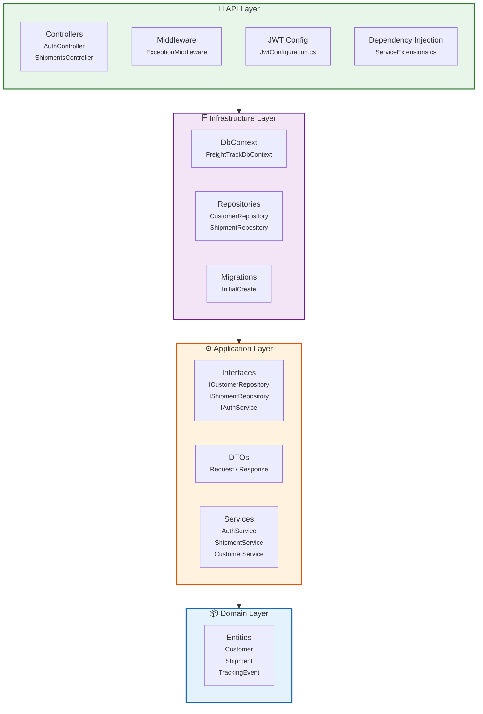
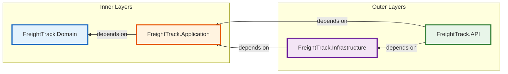
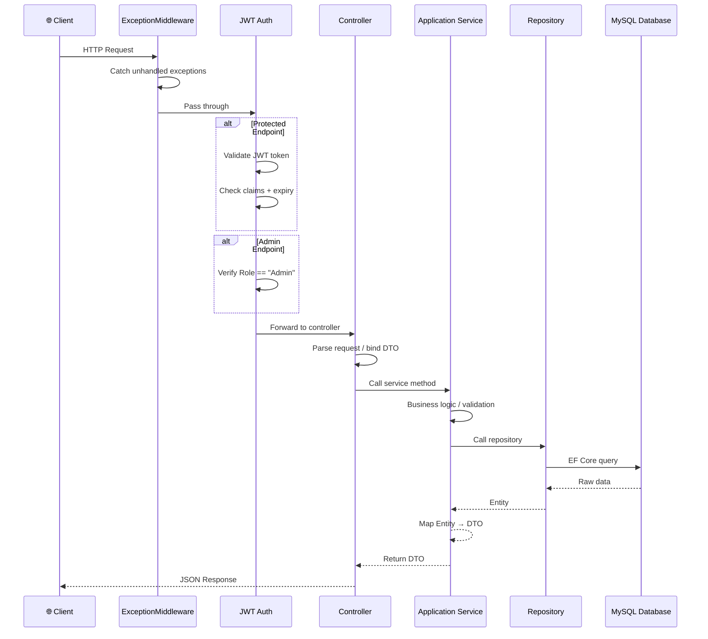
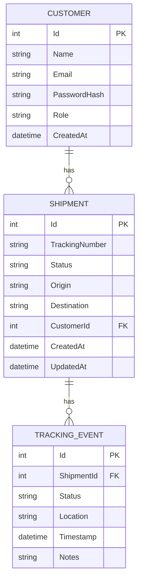
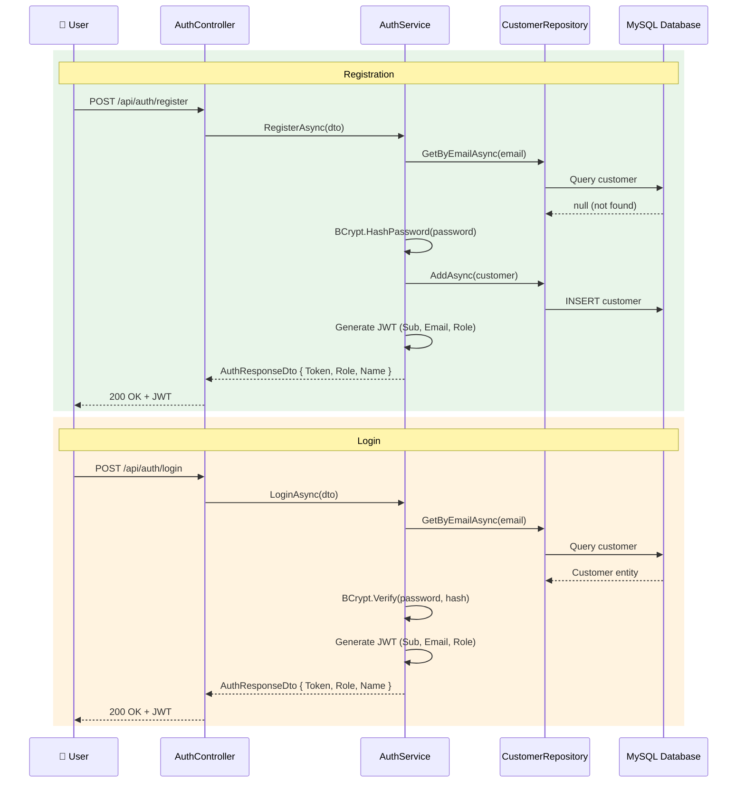

# FreightTrack API — Architecture

> A logistics shipment tracking REST API built with **ASP.NET Core 10**, **Onion Architecture**, **Entity Framework Core**, **MySQL**, and **JWT Authentication** with **Role-Based Access Control**.

---

## Table of Contents

- [Architecture Overview](#architecture-overview)
- [Layer Architecture (Onion)](#layer-architecture-onion)
  - [1. Domain Layer](#1-domain-layer)
  - [2. Application Layer](#2-application-layer)
  - [3. Infrastructure Layer](#3-infrastructure-layer)
  - [4. API Layer (Presentation)](#4-api-layer-presentation)
- [Dependency Flow](#dependency-flow)
- [Request Lifecycle](#request-lifecycle)
- [Project Structure](#project-structure)
- [Database Schema](#database-schema)
- [Authentication & Authorization](#authentication--authorization)
- [Middleware Pipeline](#middleware-pipeline)
- [API Endpoints](#api-endpoints)
- [Technology Stack](#technology-stack)
- [NuGet Packages](#nuget-packages)

---

## Architecture Overview

FreightTrack follows **Onion Architecture** (also known as Clean/Hexagonal Architecture), which enforces a strict separation of concerns by organizing code into concentric layers. The core principle is that **dependencies point inward** — inner layers define abstractions, and outer layers implement them.



> **Direction of dependency:** API → Infrastructure → Application → Domain

---

## Layer Architecture (Onion)

### 1. Domain Layer

**Project:** `FreightTrack.Domain`  
**Dependencies:** None (zero external packages)

The innermost layer contains enterprise-wide business entities. It has **no external dependencies** whatsoever.

#### Entities

| Entity | Properties | Description |
|---|---|---|
| **Customer** | `Id`, `Name`, `Email`, `PasswordHash`, `Role`, `CreatedAt`, `Shipments` (nav) | Represents a user of the system (Admin or Customer) |
| **Shipment** | `Id`, `TrackingNumber`, `Status`, `Origin`, `Destination`, `CustomerId`, `CreatedAt`, `UpdatedAt`, `Customer` (nav), `TrackingEvents` (nav) | Represents a freight shipment |
| **TrackingEvent** | `Id`, `ShipmentId`, `Status`, `Location`, `Timestamp`, `Notes`, `Shipment` (nav) | An event logged during a shipment's journey |

#### Key Characteristics

- Pure C# classes with no framework attributes (beyond `[Key]`)
- No references to EF Core, ASP.NET, or any external library
- Navigation properties define relationships without persistence concerns
- Acts as the source of truth for business data

---

### 2. Application Layer

**Project:** `FreightTrack.Application`  
**Dependencies:** `FreightTrack.Domain`

This layer orchestrates business logic and defines the contracts between outer and inner layers. It contains:

#### Interfaces (Contracts)

| Interface | Methods | Purpose |
|---|---|---|
| `ICustomerRepository` | `GetByIdAsync`, `GetByEmailAsync`, `AddAsync` | Contract for customer data access |
| `IShipmentRepository` | `GetByIdAsync`, `GetAllAsync`, `AddAsync`, `UpdateAsync`, `DeleteAsync`, `AddTrackingEventAsync`, `GetTrackingHistoryAsync`, `GetFilteredAsync` | Contract for shipment data access |
| `ITrackingEventRepository` | `AddAsync`, `GetByShipmentIdAsync` | Contract for tracking event data access |
| `IAuthService` | `RegisterAsync`, `LoginAsync` | Authentication business logic |
| `ICustomerService` | `GetByIdAsync`, `GetByEmailAsync`, `AddAsync` | Customer business logic |
| `IShipmentService` | `GetAllAsync`, `GetByIdAsync`, `AddAsync`, `UpdateAsync`, `DeleteAsync`, `AddTrackingEventAsync`, `GetTrackingHistoryAsync`, `GetFilteredAsync` | Shipment business logic |

#### DTOs (Data Transfer Objects)

**Request DTOs:**

| DTO | Properties | Used In |
|---|---|---|
| `RegisterDto` | `Name`, `Email`, `Password`, `Role` | Auth registration |
| `LoginDto` | `Email`, `Password` | Auth login |
| `CreateShipmentDto` | `Origin`, `Destination`, `CustomerId` | Creating/updating shipments |
| `AddTrackingEventDto` | `Status`, `Location`, `Notes` | Adding tracking events |
| `ShipmentFilterDto` | `Status`, `CustomerId?`, `FromDate?`, `ToDate?` | Filtering shipments |
| `CreateCustomerDto` | `Name`, `Email`, `Password`, `Role` | Creating customers |

**Response DTOs:**

| DTO | Properties | Purpose |
|---|---|---|
| `AuthResponseDto` | `Token`, `Role`, `Name` | JWT auth response |
| `ShipmentDto` | `Id`, `TrackingNumber`, `Status`, `Origin`, `Destination`, `CustomerId`, `CreatedAt` | Shipment data response |
| `TrackingEventDto` | `Id`, `Status`, `Location`, `Timestamp`, `Notes` | Tracking event response |
| `CustomerDto` | `Id`, `Name`, `Email`, `Role` | Customer data response |

#### Service Implementations

| Service | Key Logic |
|---|---|
| **AuthService** | Registers users with BCrypt password hashing, authenticates users, generates JWT tokens with claims (Sub, Email, Role) |
| **CustomerService** | Maps Customer entities to CustomerDto; CRUD operations via repository |
| **ShipmentService** | Creates shipments with auto-generated GUID tracking numbers, manages tracking events, supports filtering |

---

### 3. Infrastructure Layer

**Project:** `FreightTrack.Infrastructure`  
**Dependencies:** `FreightTrack.Application`

This layer implements the contracts defined in the Application layer. It handles all **data persistence concerns**.

#### DbContext

```csharp
public class FreightTrackDbContext : DbContext
{
    public DbSet<Shipment> Shipments { get; set; }
    public DbSet<Customer> Customers { get; set; }
    public DbSet<TrackingEvent> TrackingEvents { get; set; }
}
```

- Uses **Pomelo.EntityFrameworkCore.MySql** as the MySQL provider
- Configured in `Program.cs` via `UseMySql()` with auto-detected server version

#### Repository Implementations

| Repository | Key Implementation Details |
|---|---|
| **CustomerRepository** | `FindAsync` for ID lookup, `FirstOrDefaultAsync` for email lookup, `AddAsync` + `SaveChangesAsync` |
| **ShipmentRepository** | Full CRUD + `AddTrackingEventAsync` (sets `ShipmentId` + `Timestamp`), `GetTrackingHistoryAsync` (ordered desc by timestamp), `GetFilteredAsync` (dynamic query with optional filters for Status, CustomerId, FromDate, ToDate) |

#### Entity Framework Migrations

- One initial migration: `20260509132919_InitialCreate`
- Creates the `Customers`, `Shipments`, and `TrackingEvents` tables

---

### 4. API Layer (Presentation)

**Project:** `FreightTrack.API`  
**Dependencies:** `FreightTrack.Application`, `FreightTrack.Infrastructure`

The outermost layer is the entry point for HTTP requests. It handles **routing, authentication, authorization, error handling, and Swagger documentation**.

#### Controllers

| Controller | Route | Auth | Description |
|---|---|---|---|
| **AuthController** | `api/auth` | Public | Register and login endpoints |
| **ShipmentsController** | `api/shipments` | JWT (all), Admin (delete) | Full shipment management |

#### Middleware

| Middleware | Order | Purpose |
|---|---|---|
| `ExceptionMiddleware` | 1st | Global exception handler — catches all unhandled exceptions and returns structured JSON with status code 500 |
| `UseAuthentication` | After routing | Validates JWT tokens on incoming requests |
| `UseAuthorization` | After auth | Enforces role-based access on `[Authorize]` and `[Authorize(Roles = "Admin")]` attributes |

#### JWT Configuration

- Configured in `JwtConfiguration.cs`
- Validates: Issuer, Audience, Lifetime, Signing Key
- Clock skew: 2 minutes
- Uses HMAC-SHA256 symmetric key

#### Dependency Injection (ServiceExtensions)

All services and repositories are registered as Scoped in `ServiceExtensions.cs`:

```csharp
services.AddScoped<IShipmentRepository, ShipmentRepository>();
services.AddScoped<ICustomerRepository, CustomerRepository>();
services.AddScoped<IShipmentService, ShipmentService>();
services.AddScoped<ICustomerService, CustomerService>();
services.AddScoped<IAuthService, AuthService>();
```

#### Swagger Configuration

- Swagger UI with JWT Bearer token input
- Security definition: HTTP Bearer scheme
- Root URL (`/`) redirects to `/swagger`

---

## Dependency Flow



**Direction of dependency (inward):** `API → Infrastructure → Application → Domain`

| Layer | Knows About |
|---|---|
| **Domain** | Nothing (zero dependencies) |
| **Application** | Domain only |
| **Infrastructure** | Application (to implement interfaces) + Domain (to use entities) |
| **API** | Application (to inject services) + Infrastructure (to register DI and DbContext) |

---

## Request Lifecycle



---

## Project Structure

```
FreightTrack/
│
├── FreightTrack.slnx                        # Solution file
│
├── FreightTrack.Domain/                      # Layer 1: Core Entities
│   ├── Models/
│   │   ├── Customer.cs
│   │   ├── Shipment.cs
│   │   └── TrackingEvent.cs
│   └── FreightTrack.Domain.csproj
│
├── FreightTrack.Application/                 # Layer 2: Business Logic Contracts
│   ├── DTO/
│   │   ├── Request/
│   │   │   ├── AddTrackingEventDto.cs
│   │   │   ├── CreateCustomerDto.cs
│   │   │   ├── CreateShipmentDto.cs
│   │   │   ├── LoginDto.cs
│   │   │   ├── RegisterDto.cs
│   │   │   └── ShipmentFilterDto.cs
│   │   └── Response/
│   │       ├── AuthResponseDto.cs
│   │       ├── CustomerDto.cs
│   │       ├── ShipmentDto.cs
│   │       └── TrackingEventDto.cs
│   ├── Interface/
│   │   ├── ICustomerRepository.cs
│   │   ├── IShipmentRepository.cs
│   │   └── ITrackingEventRepository.cs
│   ├── Services/
│   │   ├── Interface/
│   │   │   ├── IAuthService.cs
│   │   │   ├── ICustomerService.cs
│   │   │   └── IShipmentService.cs
│   │   └── Implementation/
│   │       ├── AuthService.cs
│   │       ├── CustomerService.cs
│   │       └── ShipmentService.cs
│   └── FreightTrack.Application.csproj
│
├── FreightTrack.Infrastructure/              # Layer 3: Data Access
│   ├── Data/
│   │   └── FreightTrackDbContext.cs
│   ├── Migrations/
│   │   ├── 20260509132919_InitialCreate.cs
│   │   ├── 20260509132919_InitialCreate.Designer.cs
│   │   └── FreightTrackDbContextModelSnapshot.cs
│   ├── Repositories/
│   │   ├── CustomerRepository.cs
│   │   └── ShipmentRepository.cs
│   └── FreightTrack.Infrastructure.csproj
│
├── FreightTrack.API/                         # Layer 4: Presentation
│   ├── Controllers/
│   │   ├── AuthController.cs
│   │   └── ShipmentsController.cs
│   ├── Extensions/
│   │   └── ServiceExtensions.cs
│   ├── JWTConffig/
│   │   └── JwtConfiguration.cs
│   ├── Middleware/
│   │   └── ExceptionMiddleware.cs
│   ├── Properties/
│   │   └── launchSettings.json
│   ├── appsettings.json
│   ├── appsettings.Development.json
│   ├── Program.cs
│   └── FreightTrack.API.csproj
│
├── Architecture.md                           # This file
└── README.md
```

---

## Database Schema

### Entity Relationship Diagram



### Customer Table

| Column | Type | Constraints |
|---|---|---|
| Id | int | PK, Auto-increment |
| Name | nvarchar | NOT NULL |
| Email | nvarchar | NOT NULL |
| PasswordHash | nvarchar | NOT NULL (BCrypt hashed) |
| Role | nvarchar | NOT NULL ("Admin" or "Customer") |
| CreatedAt | datetime | NOT NULL |

### Shipment Table

| Column | Type | Constraints |
|---|---|---|
| Id | int | PK, Auto-increment |
| TrackingNumber | nvarchar | NOT NULL (GUID) |
| Status | nvarchar | NOT NULL (e.g., "Created", "InTransit", "Delivered") |
| Origin | nvarchar | NOT NULL |
| Destination | nvarchar | NOT NULL |
| CustomerId | int | FK → Customer.Id |
| CreatedAt | datetime | NOT NULL |
| UpdatedAt | datetime | NULL |

### TrackingEvent Table

| Column | Type | Constraints |
|---|---|---|
| Id | int | PK, Auto-increment |
| ShipmentId | int | FK → Shipment.Id |
| Status | nvarchar | NOT NULL |
| Location | nvarchar | NOT NULL |
| Timestamp | datetime | NOT NULL |
| Notes | nvarchar | NULL |

---

## Authentication & Authorization

### Flow



### JWT Token Details

| Setting | Value |
|---|---|
| Algorithm | HMAC-SHA256 |
| Issuer | `FreightTrackAPI` (from config) |
| Audience | `FreightTrackClient` (from config) |
| Expiry | 7 days (from config) |
| Claims | Subject (User ID), Email, Role |

### Protected Endpoints

- All `ShipmentsController` endpoints require `[Authorize]`
- `DELETE /api/shipments/{id}` additionally requires `[Authorize(Roles = "Admin")]`

---

## Middleware Pipeline

The order in `Program.cs`:

```mermaid
graph LR
    REQ["HTTP Request"] --> MW1["1. ExceptionMiddleware<br/><small>Global error handler</small>"]
    MW1 --> SW1["2. UseSwagger<br/><small>OpenAPI spec</small>"]
    SW1 --> SW2["3. UseSwaggerUI<br/><small>Swagger interface</small>"]
    SW2 --> HTTPS["4. HttpsRedirection"]
    HTTPS --> AUTHN["5. Authentication<br/><small>JWT validation</small>"]
    AUTHN --> AUTHZ["6. Authorization<br/><small>Role check</small>"]
    AUTHZ --> CTRL["7. MapControllers<br/><small>Route to action</small>"]
    CTRL --> REDIR["8. Root Redirect<br/><small>/ → /swagger</small>"]
    REDIR --> RES["JSON Response"]

    style MW1 fill:#ffebee,stroke:#c62828
    style AUTHN fill:#e3f2fd,stroke:#1565c0
    style AUTHZ fill:#e3f2fd,stroke:#1565c0
    style CTRL fill:#e8f5e9,stroke:#2e7d32
```



---

## API Endpoints

### Auth (Public)

| Method | Route | Description |
|---|---|---|
| POST | `/api/auth/register` | Register a new user (name, email, password, role) |
| POST | `/api/auth/login` | Login with email/password, returns JWT |

### Shipments (Authenticated)

| Method | Route | Access | Description |
|---|---|---|---|
| GET | `/api/shipments/GetAllShipment` | Auth | Get all shipments |
| GET | `/api/shipments/GetShipmentById{id}` | Auth | Get shipment by ID |
| POST | `/api/shipments` | Auth | Create a new shipment |
| PUT | `/api/shipments/{id}` | Auth | Update a shipment |
| DELETE | `/api/shipments/{id}` | Admin | Delete a shipment |
| POST | `/api/shipments/{id}/events` | Auth | Add tracking event to a shipment |
| GET | `/api/shipments/{id}/history` | Auth | Get tracking history for a shipment |
| GET | `/api/shipments/filter` | Auth | Filter shipments by status, customer, date range |
| GET | `/api/shipments/export` | Auth | Export all shipments as CSV |

---

## Technology Stack

| Category | Technology | Version |
|---|---|---|
| **Framework** | ASP.NET Core | 10.0 |
| **Language** | C# | 10.0 (ImplicitUsings, Nullable enabled) |
| **Architecture** | Onion Architecture | — |
| **ORM** | Entity Framework Core | 9.0.x |
| **Database** | MySQL (via Pomelo) | 9.0.0 |
| **Authentication** | JWT Bearer Tokens | ASP.NET Core 10.0.8 |
| **Authorization** | Role-Based Access Control (RBAC) | — |
| **Password Hashing** | BCrypt | BCrypt.Net-Next 4.2.0 |
| **API Documentation** | Swagger / Swashbuckle | 6.5.0 |
| **OpenAPI** | Microsoft.OpenApi | 1.6.14 |

---

## NuGet Packages

| Package | Version | Layer | Purpose |
|---|---|---|---|
| `Pomelo.EntityFrameworkCore.MySql` | 9.0.0 | Infrastructure | MySQL provider for EF Core |
| `Microsoft.EntityFrameworkCore.Tools` | 9.0.14 | Infrastructure | EF Core CLI commands (migrations) |
| `Microsoft.EntityFrameworkCore.Design` | 9.0.14 | Infrastructure | EF Core design-time support |
| `Microsoft.EntityFrameworkCore.Relational` | 9.0.15 | Infrastructure | EF Core relational database provider |
| `BCrypt.Net-Next` | 4.2.0 | Application/Infrastructure | Secure password hashing |
| `Microsoft.Extensions.Configuration.Abstractions` | 9.0.15 | Application | Configuration access |
| `Microsoft.IdentityModel.Tokens` | 8.18.0 | Application | JWT token creation |
| `System.IdentityModel.Tokens.Jwt` | 8.0.1 | Application | JWT token handling |
| `Microsoft.AspNetCore.Authentication.JwtBearer` | 10.0.8 | API | JWT authentication middleware |
| `Microsoft.EntityFrameworkCore.Design` | 9.0.15 | API | EF Core design-time support (migration CLI) |
| `Microsoft.OpenApi` | 1.6.14 | API | OpenAPI specifications |
| `Swashbuckle.AspNetCore` | 6.5.0 | API | Swagger UI and API documentation |

---

*Document generated for FreightTrack API*
